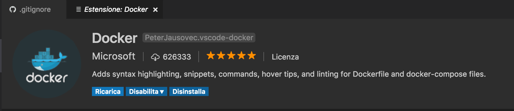

# Quick Start Explained
let's go with openshift-orign 
## pre-requisites ( my environment )
### docker
[Get started with Docker for Mac](https://docs.docker.com/docker-for-mac/)


``` bash 
$ docker --version
Docker version 17.03.1-ce, build c6d412e
```
### openshift origin
[Get Started with the CLI](https://docs.openshift.org/latest/cli_reference/get_started_cli.html)

``` bash
$ oc version
oc v1.5.0+031cbe4
kubernetes v1.5.2+43a9be4
features: Basic-Auth

Server https://127.0.0.1:8443
openshift v1.5.0+031cbe4
kubernetes v1.5.2+43a9be4

$ oc status
The connection to the server 127.0.0.1:8443 was refused - did you specify the right host or port?

$ oc cluster up
-- Checking OpenShift client ... OK
-- Checking Docker client ... OK
-- Checking Docker version ... 
   WARNING: Cannot verify Docker version
-- Checking for existing OpenShift container ... OK
-- Checking for openshift/origin:v1.5.0 image ... OK
-- Checking Docker daemon configuration ... OK
-- Checking for available ports ... OK
-- Checking type of volume mount ... 
   Using Docker shared volumes for OpenShift volumes
-- Creating host directories ... OK
-- Finding server IP ... 
   Using 127.0.0.1 as the server IP
-- Starting OpenShift container ... 
   Creating initial OpenShift configuration
   Starting OpenShift using container 'origin'
   Waiting for API server to start listening
   OpenShift server started
-- Adding default OAuthClient redirect URIs ... OK
-- Installing registry ... OK
-- Installing router ... OK
-- Importing image streams ... OK
-- Importing templates ... OK
-- Login to server ... OK
-- Creating initial project "myproject" ... OK
-- Removing temporary directory ... OK
-- Checking container networking ... OK
-- Server Information ... 
   OpenShift server started.
   The server is accessible via web console at:
       https://127.0.0.1:8443

   You are logged in as:
       User:     developer
       Password: *********

   To login as administrator:
       oc login -u ********:admin

$ oc status
In project My Project (myproject) on server https://127.0.0.1:8443

You have no services, deployment configs, or build configs.
Run 'oc new-app' to create an application.

```
Important things to look at:
- from the output of ```oc cluster up```
```Creating initial project "myproject" ... OK``
- from the output of ```oc status``
```In project My Project (myproject) on server https://127.0.0.1:8443```

```oc cluster up``` has started five containers: 
    
- docker-registry
- haproxy-router
- origin-pod
- origin-pod (services exposed on ports: 0.0.0.0:80->80/tcp, 0.0.0.0:443->443/tcp, 0.0.0.0:1936->1936/tcp)
- origin

``` bash
$ docker ps
CONTAINER ID        IMAGE                                     COMMAND                  CREATED             STATUS              PORTS                                                              NAMES
67d62b0c58a7        openshift/origin-docker-registry:v1.5.0   "/bin/sh -c 'DOCKE..."   31 minutes ago      Up 31 minutes                                                                          k8s_registry.182cd305_docker-registry-1-96qvm_default_faadf000-7342-11e7-a3c7-22fd782a32ab_17b0eb1b
5fa409ab1c66        openshift/origin-haproxy-router:v1.5.0    "/usr/bin/openshif..."   31 minutes ago      Up 31 minutes                                                                          k8s_router.d0ff2a42_router-1-t2tn4_default_fa800d30-7342-11e7-a3c7-22fd782a32ab_68519235
3e2e2d39bf4a        openshift/origin-pod:v1.5.0               "/pod"                   31 minutes ago      Up 31 minutes                                                                          k8s_POD.a4a0fe84_docker-registry-1-96qvm_default_faadf000-7342-11e7-a3c7-22fd782a32ab_ee47019f
1595e962b3ff        openshift/origin-pod:v1.5.0               "/pod"                   31 minutes ago      Up 31 minutes       0.0.0.0:80->80/tcp, 0.0.0.0:443->443/tcp, 0.0.0.0:1936->1936/tcp   k8s_POD.efdd479f_router-1-t2tn4_default_fa800d30-7342-11e7-a3c7-22fd782a32ab_f23e4ecd
6d69655cf7f1        openshift/origin:v1.5.0                   "/usr/bin/openshif..."   31 minutes ago      Up 31 minutes                                                                          origin 
```

still no resources in origin
``` bash
$ oc get all
No resources found.
```
confirmed in the gui [openshift web console](https://127.0.0.1:8443/console) 
login as: 'developer' and see the project My Project (myproject) still without resources defined


both in [web console](https://127.0.0.1:8443/console) and the CLI you can get different types of resources:

``` bash
$ oc get
You must specify the type of resource to get. Valid resource types include:

    * buildconfigs (aka 'bc')
    * builds
    * clusters (valid only for federation apiservers)
    * componentstatuses (aka 'cs')
    * configmaps (aka 'cm')
    * daemonsets (aka 'ds')
    * deployments (aka 'deploy')
    * deploymentconfigs (aka 'dc')
    * endpoints (aka 'ep')
    * events (aka 'ev')
    * horizontalpodautoscalers (aka 'hpa')
    * imagestreamimages (aka 'isimage')
    * imagestreams (aka 'is')
    * imagestreamtags (aka 'istag')
    * ingresses (aka 'ing')
    * groups
    * jobs
    * limitranges (aka 'limits')
    * namespaces (aka 'ns')
    * networkpolicies
    * nodes (aka 'no')
    * persistentvolumeclaims (aka 'pvc')
    * persistentvolumes (aka 'pv')
    * pods (aka 'po')
    * podsecuritypolicies (aka 'psp')
    * podtemplates
    * policies
    * projects
    * replicasets (aka 'rs')
    * replicationcontrollers (aka 'rc')
    * resourcequotas (aka 'quota')
    * rolebindings
    * routes
    * secrets
    * serviceaccounts (aka 'sa')
    * services (aka 'svc')
    * statefulsets
    * users
    * storageclasses
    * thirdpartyresources
    error: Required resource not specified.
Use "oc explain <resource>" for a detailed description of that resource (e.g. oc explain pods).
See 'oc get -h' for help and examples.
```

It's worth learning about some kubernetes resource types we have to deal:
- [Managing Compute Resources for Containers](https://kubernetes.io/docs/concepts/configuration/manage-compute-resources-container/)
- [kubectl Cheat Sheet](https://kubernetes.io/docs/user-guide/kubectl-cheatsheet/)

... or just in terminal for example:

``` bash
$ oc explain services
DESCRIPTION:
Service is a named abstraction of software service (for example, mysql) consisting of local port (for example 3306) that the proxy listens on, and the selector that determines which pods will answer requests sent through the proxy.

FIELDS:
   spec	<Object>
     Spec defines the behavior of a service.
     http://releases.k8s.io/HEAD/docs/devel/api-conventions.md#spec-and-status

   status	<Object>
     Most recently observed status of the service. Populated by the system.
     Read-only. More info:
     http://releases.k8s.io/HEAD/docs/devel/api-conventions.md#spec-and-status

   apiVersion	<string>
     APIVersion defines the versioned schema of this representation of an
     object. Servers should convert recognized schemas to the latest internal
     value, and may reject unrecognized values. More info:
     http://releases.k8s.io/HEAD/docs/devel/api-conventions.md#resources

   kind	<string>
     Kind is a string value representing the REST resource this object
     represents. Servers may infer this from the endpoint the client submits
     requests to. Cannot be updated. In CamelCase. More info:
     http://releases.k8s.io/HEAD/docs/devel/api-conventions.md#types-kinds

   metadata	<Object>
     Standard object s metadata. More info:
     http://releases.k8s.io/HEAD/docs/devel/api-conventions.md#metadata


$ oc explain pods
DESCRIPTION:
Pod is a collection of containers that can run on a host. This resource is created by clients and scheduled onto hosts.

FIELDS:
   status	<Object>
     Most recently observed status of the pod. This data may not be up to date.
     Populated by the system. Read-only. More info:
     http://releases.k8s.io/HEAD/docs/devel/api-conventions.md#spec-and-status

   apiVersion	<string>
     APIVersion defines the versioned schema of this representation of an
     object. Servers should convert recognized schemas to the latest internal
     value, and may reject unrecognized values. More info:
     http://releases.k8s.io/HEAD/docs/devel/api-conventions.md#resources

   kind	<string>
     Kind is a string value representing the REST resource this object
     represents. Servers may infer this from the endpoint the client submits
     requests to. Cannot be updated. In CamelCase. More info:
     http://releases.k8s.io/HEAD/docs/devel/api-conventions.md#types-kinds

   metadata	<Object>
     Standard object s metadata. More info:
     http://releases.k8s.io/HEAD/docs/devel/api-conventions.md#metadata

   spec	<Object>
     Specification of the desired behavior of the pod. More info:
     http://releases.k8s.io/HEAD/docs/devel/api-conventions.md#spec-and-status
```

### Visual Studio Code and extensions for docker 
optionals:
- [Visual Studio Code](https://code.visualstudio.com/)
- [Working with Dockerfiles in Visual Studio Code](https://code.visualstudio.com/docs/languages/dockerfile)
    - [vscode-docker](https://github.com/Microsoft/vscode-docker)


useful to work on ```Dockerfile```

