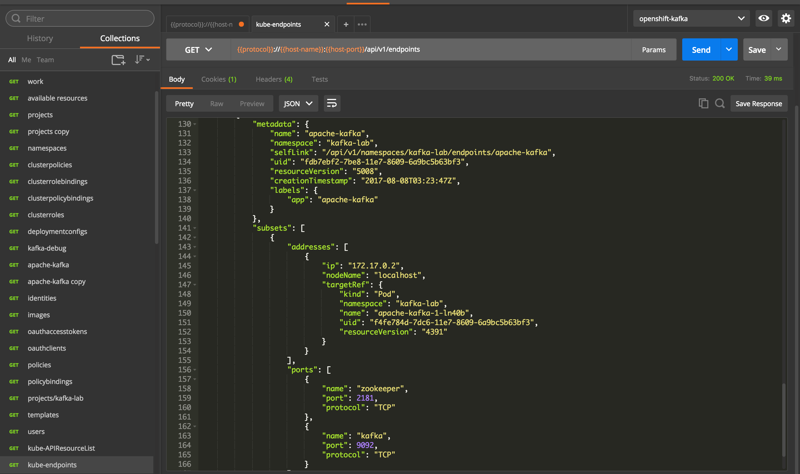

# "OpenShift Origin v1 REST API" and "Kubernetes v1 REST API" basic notes
[Overview](https://docs.openshift.org/latest/rest_api/openshift_v1.html)

## JWT Authorization
[https://tools.ietf.org/html/rfc7519]
<cite>
 JSON Web Token (JWT) is a compact, URL-safe means of representing
   claims to be transferred between two parties.  The claims in a JWT
   are encoded as a JSON object that is used as the payload of a JSON
   Web Signature (JWS) structure or as the plaintext of a JSON Web
   Encryption (JWE) structure, enabling the claims to be digitally
   signed or integrity protected with a Message Authentication Code
   (MAC) and/or encrypted.
 </cite> 

## Add a Service Account robot for the API
we want to use ```Service Account Tokens``` for our lab: 

``` bash
openshift-kafka (develop)*$ oc create serviceaccount robot
serviceaccount "robot" created
openshift-kafka (develop)*$ oc policy add-role-to-user admin system:serviceaccounts:test:robot
role "admin" added: "system:serviceaccounts:test:robot"
openshift-kafka (develop)*$ oc serviceaccounts get-token robot
```

for **Authentication** requirements copy the token to the [Authorization HTTP header](https://www.w3.org/Protocols/rfc2616/rfc2616-sec14.html#sec14.8)

 

pay attention to use exacly only one blank space between Baerer and the token
``` 
[{"key":"Authorization","value":"Bearer {{bearer-token}}","description":""}]
```
or you coul'd get unexpected result such as: 
``` json
{
    "kind": "Status",
    "apiVersion": "v1",
    "metadata": {},
    "status": "Failure",
    "message": "User \"system:anonymous\" cannot list all namespaces in the cluster",
    "reason": "Forbidden",
    "details": {
        "kind": "namespaces"
    },
    "code": 403
}
``` 

When everything is set correctly you can invoke the [OpenShift Origin v1 REST API](https://docs.openshift.org/latest/rest_api/openshift_v1.html) which will provide its result 
 

You can also invoke [Kubernetes v1 REST API](https://docs.openshift.org/latest/rest_api/kubernetes_v1.html)
 

### Get the privileges for the 'robot'
This lab It aims to be able to try as much as possible the whole API: You may need  [to add-cluster-role-to-user 'robot'](./origin-cluster-admin-notes.md) 


# Exploring the API
A good starting point for exploring is ```GET /oapi/v1``` to [get available resources](./api-response-get-avail-resources.json) 

Some resources are namespaced and some are not:
An example of a resource ```"namespaced": true``` is ```templates```
``` json
    {
      "name": "templates",
      "namespaced": true,
      "kind": "Template",
      "verbs": [
        "create",
        "delete",
        "deletecollection",
        "get",
        "list",
        "patch",
        "update",
        "watch"
      ]
    },
```

An example of a resource ```"namespaced": false``` is ```images```
``` json
    {
      "name": "images",
      "namespaced": false,
      "kind": "Image",
      "verbs": [
        "create",
        "delete",
        "deletecollection",
        "get",
        "list",
        "patch",
        "update",
        "watch"
      ]
    } 
```
## Namespaced resources API
For ```namespaced resources``` it is possible build the path in this way: 
```{VERB} /oapi/v1/namespaces/{namespace}/{resource}```
for example: **list or watch objects of kind Template**
```GET /oapi/v1/namespaces/{namespace}/templates```


## Reference documentation
check your current version 
``` bash
$ oc version
oc v3.6.0+c4dd4cf
kubernetes v1.6.1+5115d708d7
features: Basic-Auth

Server https://127.0.0.1:8443
openshift v3.6.0+c4dd4cf
kubernetes v1.6.1+5115d708d7
```
once I get my oc version ( v.3.6.0 ) I can build my PDF reference URL:

[pdf: https://access.redhat.com/documentation/en-us/openshift_container_platform/3.6/pdf/rest_api_reference/OpenShift_Container_Platform-3.6-REST_API_Reference-en-US.pdf](https://access.redhat.com/documentation/en-us/openshift_container_platform/3.6/pdf/rest_api_reference/OpenShift_Container_Platform-3.6-REST_API_Reference-en-US.pdf)

[or get the latest](https://docs.openshift.org/latest/rest_api/openshift_v1.html)