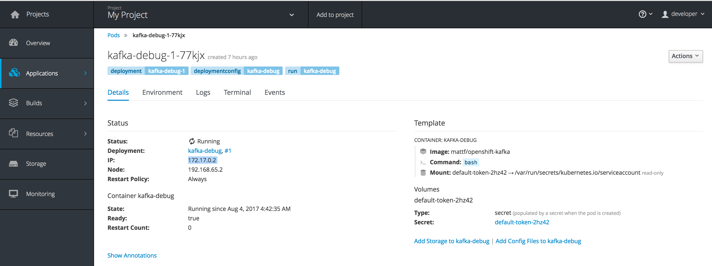

# networking basic

## host


## pods
```
$ oc attach kafka-debug-1-77kjx -c kafka-debug -i -t    
bash-4.2$ uname -a  
Linux kafka-debug-1-77kjx 4.9.13-moby #1 SMP Sat Mar 25 02:48:44 UTC 2017 x86_64 x86_64 x86_64 GNU/Linux
bash-4.2$ id
uid=1000040000 gid=0(root) groups=0(root),1000040000
``` 

## Note about networking 
### docker network ls
``` bash 
 $ docker network ls
NETWORK ID          NAME                DRIVER              SCOPE
ff39ca7ea369        bridge              bridge              local
f57e2ec0f960        host                host                local
006258c75033        none                null                local
```

### docker network inspect
to inpect ```IPv4Address``` for each pod:
``` bash
$ docker network inspect ff39ca7ea369
[
    {
        "Name": "bridge",
        "Id": "ff39ca7ea36941de14c3f1b29363697c2f82cf656c8bdc9766e354e92ef47ed3",
        "Created": "2017-07-29T11:51:33.573361153Z",
        "Scope": "local",
        "Driver": "bridge",
        "EnableIPv6": false,
        "IPAM": {
            "Driver": "default",
            "Options": null,
            "Config": [
                {
                    "Subnet": "172.17.0.0/16",
                    "Gateway": "172.17.0.1"
                }
            ]
        },
        "Internal": false,
        "Attachable": false,
        "Containers": {
            "afed145c3b7479693fad51fc820b742648785688a7d60a75f7d0c03ddcc4643e": {
                "Name": "k8s_POD.4ebadca1_kafka-debug-1-f6f7g_myproject_092cf205-786c-11e7-954e-1a37f55db1e1_70ff32d5",
                "EndpointID": "b89f6eba96a998f3776348e4cee0ed606bb7d66bb07ad75c3327cf453e140970",
                "MacAddress": "02:42:ac:11:00:04",
                "IPv4Address": "172.17.0.4/16",
                "IPv6Address": ""
            },
            "bd05667c8fc93d460e6d03c1ee9d084c0e4e51f34248700be4c9196a2af81f15": {
                "Name": "k8s_POD.2bb521b1_apache-kafka-1-k7d8j_myproject_e6acf37b-7801-11e7-954e-1a37f55db1e1_a13228cd",
                "EndpointID": "64aa4c41317548510d0bcdd98831bd4737e4312760cc0b34cfe09e8768a1860d",
                "MacAddress": "02:42:ac:11:00:03",
                "IPv4Address": "172.17.0.3/16",
                "IPv6Address": ""
            }
        },
        "Options": {
            "com.docker.network.bridge.default_bridge": "true",
            "com.docker.network.bridge.enable_icc": "true",
            "com.docker.network.bridge.enable_ip_masquerade": "true",
            "com.docker.network.bridge.host_binding_ipv4": "0.0.0.0",
            "com.docker.network.bridge.name": "docker0",
            "com.docker.network.driver.mtu": "1500"
        },
        "Labels": {}
    }
]


  ronda@MacBook-Pro-di-Franco.local ~/projects/rondinif/openshift-kafka/doc  
 04:33:09 $ oc get all
NAME              REVISION   DESIRED   CURRENT   TRIGGERED BY
dc/apache-kafka   1          1         1         config
dc/kafka-debug    1          1         1         config

NAME                DESIRED   CURRENT   READY     AGE
rc/apache-kafka-1   1         1         1         22h
rc/kafka-debug-1    1         1         1         9h

NAME               CLUSTER-IP      EXTERNAL-IP   PORT(S)             AGE
svc/apache-kafka   172.30.48.115   <none>        9092/TCP,2181/TCP   22h

NAME                      READY     STATUS    RESTARTS   AGE
po/apache-kafka-1-k7d8j   2/2       Running   1          22h
po/kafka-debug-1-77kjx    1/1       Running   0          46s
  ronda@MacBook-Pro-di-Franco.local ~/projects/rondinif/openshift-kafka/doc  
 04:43:11 $ docker network inspect -v ff39ca7ea369
unknown shorthand flag: 'v' in -v
See 'docker network inspect --help'.
  ronda@MacBook-Pro-di-Franco.local ~/projects/rondinif/openshift-kafka/doc  
 04:43:24 $ docker network inspect  ff39ca7ea369
[
    {
        "Name": "bridge",
        "Id": "ff39ca7ea36941de14c3f1b29363697c2f82cf656c8bdc9766e354e92ef47ed3",
        "Created": "2017-07-29T11:51:33.573361153Z",
        "Scope": "local",
        "Driver": "bridge",
        "EnableIPv6": false,
        "IPAM": {
            "Driver": "default",
            "Options": null,
            "Config": [
                {
                    "Subnet": "172.17.0.0/16",
                    "Gateway": "172.17.0.1"
                }
            ]
        },
        "Internal": false,
        "Attachable": false,
        "Containers": {
            "b2a7af746247be21a7c5d82961079a6b09f7d11953654051817b7613285e8c67": {
                "Name": "k8s_POD.4ebadca1_kafka-debug-1-77kjx_myproject_8c809f22-78be-11e7-954e-1a37f55db1e1_9500cfd7",
                "EndpointID": "3885c15a12e17d15d5530ab0f3bd7940b5bfd044cb20044e5eb9d2a2331a4f27",
                "MacAddress": "02:42:ac:11:00:02",
                "IPv4Address": "172.17.0.2/16",
                "IPv6Address": ""
            },
            "bd05667c8fc93d460e6d03c1ee9d084c0e4e51f34248700be4c9196a2af81f15": {
                "Name": "k8s_POD.2bb521b1_apache-kafka-1-k7d8j_myproject_e6acf37b-7801-11e7-954e-1a37f55db1e1_a13228cd",
                "EndpointID": "64aa4c41317548510d0bcdd98831bd4737e4312760cc0b34cfe09e8768a1860d",
                "MacAddress": "02:42:ac:11:00:03",
                "IPv4Address": "172.17.0.3/16",
                "IPv6Address": ""
            }
        },
        "Options": {
            "com.docker.network.bridge.default_bridge": "true",
            "com.docker.network.bridge.enable_icc": "true",
            "com.docker.network.bridge.enable_ip_masquerade": "true",
            "com.docker.network.bridge.host_binding_ipv4": "0.0.0.0",
            "com.docker.network.bridge.name": "docker0",
            "com.docker.network.driver.mtu": "1500"
        },
        "Labels": {}
    }
]
```
### ip exposed to host and internal to docker
both pod's ip reported by ```network inspect``` and ```svc CLUSTER-IP``` reported by ```oc get all``` are visibile in the docker network from inside 
but not from the host (i.e: mac os x hosting the containers)

```
$ oc get all
NAME              REVISION   DESIRED   CURRENT   TRIGGERED BY
dc/apache-kafka   1          1         1         config
dc/kafka-debug    1          1         1         config

NAME                DESIRED   CURRENT   READY     AGE
rc/apache-kafka-1   1         1         1         22h
rc/kafka-debug-1    1         1         1         9h

NAME               CLUSTER-IP      EXTERNAL-IP   PORT(S)             AGE
svc/apache-kafka   172.30.48.115   <none>        9092/TCP,2181/TCP   22h

NAME                      READY     STATUS    RESTARTS   AGE
po/apache-kafka-1-k7d8j   2/2       Running   1          22h
po/kafka-debug-1-77kjx    1/1       Running   0          2m
```

for example when a pod:
```
bash-4.2$ uname -a
Linux kafka-debug-1-77kjx 4.9.13-moby #1 SMP Sat Mar 25 02:48:44 UTC 2017 x86_64 x86_64 x86_64 GNU/Linux
bash-4.2$ id
uid=1000040000 gid=0(root) groups=0(root),1000040000

$ ping 172.30.48.115
PING 172.30.48.115 (172.30.48.115) 56(84) bytes of data.
64 bytes from 172.30.48.115: icmp_seq=1 ttl=37 time=0.379 ms
64 bytes from 172.30.48.115: icmp_seq=2 ttl=37 time=0.405 ms
64 bytes from 172.30.48.115: icmp_seq=3 ttl=37 time=0.293 ms
64 bytes from 172.30.48.115: icmp_seq=4 ttl=37 time=0.426 ms
64 bytes from 172.30.48.115: icmp_seq=5 ttl=37 time=0.293 ms
^C
--- 172.30.48.115 ping statistics ---
5 packets transmitted, 5 received, 0% packet loss, time 4147ms
rtt min/avg/max/mdev = 0.293/0.359/0.426/0.057 ms
bash-4.2$ ping 127.17.0.4   
PING 127.17.0.4 (127.17.0.4) 56(84) bytes of data.
64 bytes from 127.17.0.4: icmp_seq=1 ttl=64 time=0.051 ms
64 bytes from 127.17.0.4: icmp_seq=2 ttl=64 time=0.057 ms
64 bytes from 127.17.0.4: icmp_seq=3 ttl=64 time=0.072 ms
64 bytes from 127.17.0.4: icmp_seq=4 ttl=64 time=0.054 ms
64 bytes from 127.17.0.4: icmp_seq=5 ttl=64 time=0.061 ms
^C
--- 127.17.0.4 ping statistics ---
5 packets transmitted, 5 received, 0% packet loss, time 4162ms
rtt min/avg/max/mdev = 0.051/0.059/0.072/0.007 ms
bash-4.2$ ping 127.17.0.3
PING 127.17.0.3 (127.17.0.3) 56(84) bytes of data.
64 bytes from 127.17.0.3: icmp_seq=1 ttl=64 time=0.058 ms
64 bytes from 127.17.0.3: icmp_seq=2 ttl=64 time=0.058 ms
64 bytes from 127.17.0.3: icmp_seq=3 ttl=64 time=0.054 ms
^C
--- 127.17.0.3 ping statistics ---
3 packets transmitted, 3 received, 0% packet loss, time 2076ms
rtt min/avg/max/mdev = 0.054/0.056/0.058/0.008 ms
```

### Ogni POD avrà il suo ip ?
richiedendo un nuovo pod di ```kafka-debug``` controlliamo che 
il replication controller ```rc/kafka-debug-1```  voglia ora 2 pods e che questi pods ```kafka-debug```
siano stati effettivamente avviati, infine con ```docker network inspect``` vediamo quali sono gli IP dei vari pods:

``` bash
$ oc get all
NAME              REVISION   DESIRED   CURRENT   TRIGGERED BY
dc/apache-kafka   1          1         1         config
dc/kafka-debug    1          2         2         config

NAME                DESIRED   CURRENT   READY     AGE
rc/apache-kafka-1   1         1         1         22h
rc/kafka-debug-1    2         2         2         9h

NAME               CLUSTER-IP      EXTERNAL-IP   PORT(S)             AGE
svc/apache-kafka   172.30.48.115   <none>        9092/TCP,2181/TCP   22h

NAME                      READY     STATUS    RESTARTS   AGE
po/apache-kafka-1-k7d8j   2/2       Running   1          22h
po/kafka-debug-1-77kjx    1/1       Running   0          8m
po/kafka-debug-1-rkw2t    1/1       Running   0          1m
 
$ docker network inspect  ff39ca7ea369
[
    {
        "Name": "bridge",
        "Id": "ff39ca7ea36941de14c3f1b29363697c2f82cf656c8bdc9766e354e92ef47ed3",
        "Created": "2017-07-29T11:51:33.573361153Z",
        "Scope": "local",
        "Driver": "bridge",
        "EnableIPv6": false,
        "IPAM": {
            "Driver": "default",
            "Options": null,
            "Config": [
                {
                    "Subnet": "172.17.0.0/16",
                    "Gateway": "172.17.0.1"
                }
            ]
        },
        "Internal": false,
        "Attachable": false,
        "Containers": {
            "6875d03cb72e3b1643cacb3c8aebdc626db50444ba60f31cc4111f758e2b4878": {
                "Name": "k8s_POD.4ebadca1_kafka-debug-1-rkw2t_myproject_8878a122-78bf-11e7-954e-1a37f55db1e1_7bb1bf11",
                "EndpointID": "6228f8e876d9f5b1860bc07b2dec5d105864f1ec746f382e07f0009e2fa303a4",
                "MacAddress": "02:42:ac:11:00:04",
                "IPv4Address": "172.17.0.4/16",
                "IPv6Address": ""
            },
            "b2a7af746247be21a7c5d82961079a6b09f7d11953654051817b7613285e8c67": {
                "Name": "k8s_POD.4ebadca1_kafka-debug-1-77kjx_myproject_8c809f22-78be-11e7-954e-1a37f55db1e1_9500cfd7",
                "EndpointID": "3885c15a12e17d15d5530ab0f3bd7940b5bfd044cb20044e5eb9d2a2331a4f27",
                "MacAddress": "02:42:ac:11:00:02",
                "IPv4Address": "172.17.0.2/16",
                "IPv6Address": ""
            },
            "bd05667c8fc93d460e6d03c1ee9d084c0e4e51f34248700be4c9196a2af81f15": {
                "Name": "k8s_POD.2bb521b1_apache-kafka-1-k7d8j_myproject_e6acf37b-7801-11e7-954e-1a37f55db1e1_a13228cd",
                "EndpointID": "64aa4c41317548510d0bcdd98831bd4737e4312760cc0b34cfe09e8768a1860d",
                "MacAddress": "02:42:ac:11:00:03",
                "IPv4Address": "172.17.0.3/16",
                "IPv6Address": ""
            }
        },
        "Options": {
            "com.docker.network.bridge.default_bridge": "true",
            "com.docker.network.bridge.enable_icc": "true",
            "com.docker.network.bridge.enable_ip_masquerade": "true",
            "com.docker.network.bridge.host_binding_ipv4": "0.0.0.0",
            "com.docker.network.bridge.name": "docker0",
            "com.docker.network.driver.mtu": "1500"
        },
        "Labels": {}
    }
]
```
anche dalla console si possono vedere gli indirizzi IP acquisito da  ogni singolo POD



## Exposing service to Host 
oc 
``` bash
oc port-forward apache-kafka-1-k7d8j 9092
Forwarding from 127.0.0.1:9092 -> 9092
Forwarding from [::1]:9092 -> 9092


Handling connection for 9092
Handling connection for 9092
```