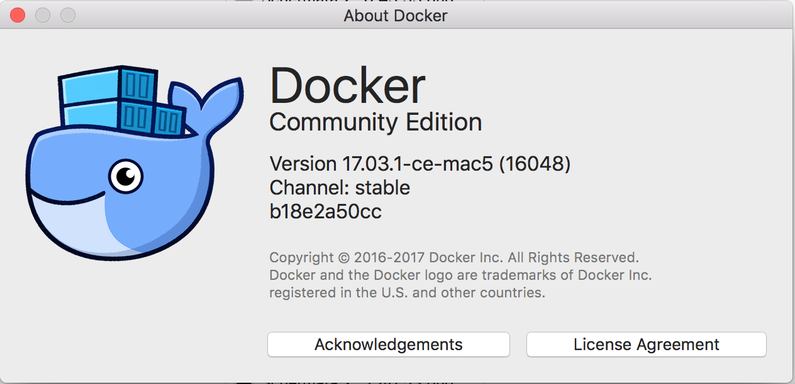
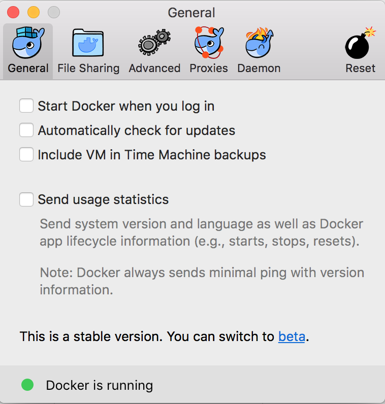
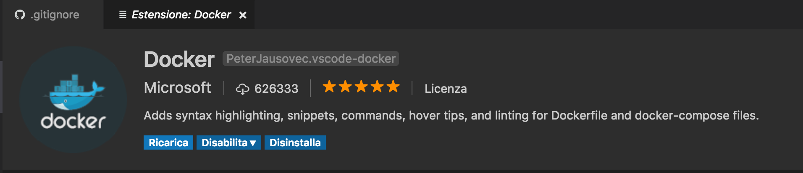
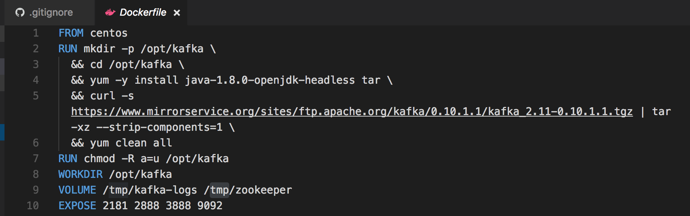

# Quick Start Explained ( part 1 of 4)
some intro notes to the platform: openshift-orign, docker and kubernetes 
## pre-requisites ( my environment )
### docker
[Get started with Docker for Mac](https://docs.docker.com/docker-for-mac/)



``` bash 
$ docker --version
Docker version 17.03.1-ce, build c6d412e
```
### openshift origin
- [Get Started with the CLI](https://docs.openshift.org/latest/cli_reference/get_started_cli.html)
- [Basic CLI operations](https://docs.openshift.org/latest/cli_reference/basic_cli_operations.html)

``` bash
$ oc version
oc v1.5.0+031cbe4
kubernetes v1.5.2+43a9be4
features: Basic-Auth

Server https://127.0.0.1:8443
openshift v1.5.0+031cbe4
kubernetes v1.5.2+43a9be4

$ oc status
The connection to the server 127.0.0.1:8443 was refused - did you specify the right host or port?

$ oc cluster up
-- Checking OpenShift client ... OK
-- Checking Docker client ... OK
-- Checking Docker version ... 
   WARNING: Cannot verify Docker version
-- Checking for existing OpenShift container ... OK
-- Checking for openshift/origin:v1.5.0 image ... OK
-- Checking Docker daemon configuration ... OK
-- Checking for available ports ... OK
-- Checking type of volume mount ... 
   Using Docker shared volumes for OpenShift volumes
-- Creating host directories ... OK
-- Finding server IP ... 
   Using 127.0.0.1 as the server IP
-- Starting OpenShift container ... 
   Creating initial OpenShift configuration
   Starting OpenShift using container 'origin'
   Waiting for API server to start listening
   OpenShift server started
-- Adding default OAuthClient redirect URIs ... OK
-- Installing registry ... OK
-- Installing router ... OK
-- Importing image streams ... OK
-- Importing templates ... OK
-- Login to server ... OK
-- Creating initial project "myproject" ... OK
-- Removing temporary directory ... OK
-- Checking container networking ... OK
-- Server Information ... 
   OpenShift server started.
   The server is accessible via web console at:
       https://127.0.0.1:8443

   You are logged in as:
       User:     developer
       Password: *********

   To login as administrator:
       oc login -u ********:admin

$ oc status
In project My Project (myproject) on server https://127.0.0.1:8443

You have no services, deployment configs, or build configs.
Run 'oc new-app' to create an application.

```
Important things to look at:
- from the output of ```oc cluster up```
```Creating initial project "myproject" ... OK``
- from the output of ```oc status``
```In project My Project (myproject) on server https://127.0.0.1:8443```

```oc cluster up``` has started five containers: 
    
- docker-registry
- haproxy-router
- origin-pod
- origin-pod (services exposed on ports: 0.0.0.0:80->80/tcp, 0.0.0.0:443->443/tcp, 0.0.0.0:1936->1936/tcp)
- origin

``` bash
$ docker ps
CONTAINER ID        IMAGE                                     COMMAND                  CREATED             STATUS              PORTS                                                              NAMES
67d62b0c58a7        openshift/origin-docker-registry:v1.5.0   "/bin/sh -c 'DOCKE..."   31 minutes ago      Up 31 minutes                                                                          k8s_registry.182cd305_docker-registry-1-96qvm_default_faadf000-7342-11e7-a3c7-22fd782a32ab_17b0eb1b
5fa409ab1c66        openshift/origin-haproxy-router:v1.5.0    "/usr/bin/openshif..."   31 minutes ago      Up 31 minutes                                                                          k8s_router.d0ff2a42_router-1-t2tn4_default_fa800d30-7342-11e7-a3c7-22fd782a32ab_68519235
3e2e2d39bf4a        openshift/origin-pod:v1.5.0               "/pod"                   31 minutes ago      Up 31 minutes                                                                          k8s_POD.a4a0fe84_docker-registry-1-96qvm_default_faadf000-7342-11e7-a3c7-22fd782a32ab_ee47019f
1595e962b3ff        openshift/origin-pod:v1.5.0               "/pod"                   31 minutes ago      Up 31 minutes       0.0.0.0:80->80/tcp, 0.0.0.0:443->443/tcp, 0.0.0.0:1936->1936/tcp   k8s_POD.efdd479f_router-1-t2tn4_default_fa800d30-7342-11e7-a3c7-22fd782a32ab_f23e4ecd
6d69655cf7f1        openshift/origin:v1.5.0                   "/usr/bin/openshif..."   31 minutes ago      Up 31 minutes                                                                          origin 
```

still no resources in origin
``` bash
$ oc get all
No resources found.
```
confirmed in the gui [openshift web console](https://127.0.0.1:8443/console) 
login as: 'developer' and see the project My Project (myproject) still without resources defined


both in [web console](https://127.0.0.1:8443/console) and the CLI you can get different types of resources:

``` bash
$ oc get
You must specify the type of resource to get. Valid resource types include:

    * buildconfigs (aka 'bc')
    * builds
    * clusters (valid only for federation apiservers)
    * componentstatuses (aka 'cs')
    * configmaps (aka 'cm')
    * daemonsets (aka 'ds')
    * deployments (aka 'deploy')
    * deploymentconfigs (aka 'dc')
    * endpoints (aka 'ep')
    * events (aka 'ev')
    * horizontalpodautoscalers (aka 'hpa')
    * imagestreamimages (aka 'isimage')
    * imagestreams (aka 'is')
    * imagestreamtags (aka 'istag')
    * ingresses (aka 'ing')
    * groups
    * jobs
    * limitranges (aka 'limits')
    * namespaces (aka 'ns')
    * networkpolicies
    * nodes (aka 'no')
    * persistentvolumeclaims (aka 'pvc')
    * persistentvolumes (aka 'pv')
    * pods (aka 'po')
    * podsecuritypolicies (aka 'psp')
    * podtemplates
    * policies
    * projects
    * replicasets (aka 'rs')
    * replicationcontrollers (aka 'rc')
    * resourcequotas (aka 'quota')
    * rolebindings
    * routes
    * secrets
    * serviceaccounts (aka 'sa')
    * services (aka 'svc')
    * statefulsets
    * users
    * storageclasses
    * thirdpartyresources
    error: Required resource not specified.
Use "oc explain <resource>" for a detailed description of that resource (e.g. oc explain pods).
See 'oc get -h' for help and examples.
```

## learning about some kubernetes resource types
It's worth learning about some kubernetes resource types we have to deal:
- [Managing Compute Resources for Containers](https://kubernetes.io/docs/concepts/configuration/manage-compute-resources-container/)
- [kubectl Cheat Sheet](https://kubernetes.io/docs/user-guide/kubectl-cheatsheet/)

... or just in terminal with  ```oc explain``` and ```oc types```

### oc explain
``` bash
$ oc explain services
DESCRIPTION:
Service is a named abstraction of software service (for example, mysql) consisting of local port (for example 3306) that the proxy listens on, and the selector that determines which pods will answer requests sent through the proxy.

FIELDS:
   spec	<Object>
     Spec defines the behavior of a service.
     http://releases.k8s.io/HEAD/docs/devel/api-conventions.md#spec-and-status

   status	<Object>
     Most recently observed status of the service. Populated by the system.
     Read-only. More info:
     http://releases.k8s.io/HEAD/docs/devel/api-conventions.md#spec-and-status

   apiVersion	<string>
     APIVersion defines the versioned schema of this representation of an
     object. Servers should convert recognized schemas to the latest internal
     value, and may reject unrecognized values. More info:
     http://releases.k8s.io/HEAD/docs/devel/api-conventions.md#resources

   kind	<string>
     Kind is a string value representing the REST resource this object
     represents. Servers may infer this from the endpoint the client submits
     requests to. Cannot be updated. In CamelCase. More info:
     http://releases.k8s.io/HEAD/docs/devel/api-conventions.md#types-kinds

   metadata	<Object>
     Standard object s metadata. More info:
     http://releases.k8s.io/HEAD/docs/devel/api-conventions.md#metadata


$ oc explain pods
DESCRIPTION:
Pod is a collection of containers that can run on a host. This resource is created by clients and scheduled onto hosts.

FIELDS:
   status	<Object>
     Most recently observed status of the pod. This data may not be up to date.
     Populated by the system. Read-only. More info:
     http://releases.k8s.io/HEAD/docs/devel/api-conventions.md#spec-and-status

   apiVersion	<string>
     APIVersion defines the versioned schema of this representation of an
     object. Servers should convert recognized schemas to the latest internal
     value, and may reject unrecognized values. More info:
     http://releases.k8s.io/HEAD/docs/devel/api-conventions.md#resources

   kind	<string>
     Kind is a string value representing the REST resource this object
     represents. Servers may infer this from the endpoint the client submits
     requests to. Cannot be updated. In CamelCase. More info:
     http://releases.k8s.io/HEAD/docs/devel/api-conventions.md#types-kinds

   metadata	<Object>
     Standard object s metadata. More info:
     http://releases.k8s.io/HEAD/docs/devel/api-conventions.md#metadata

   spec	<Object>
     Specification of the desired behavior of the pod. More info:
     http://releases.k8s.io/HEAD/docs/devel/api-conventions.md#spec-and-status
```

### oc types
``` bash 
$ oc types
Concepts and Types 

Kubernetes and OpenShift help developers and operators build, test, and deploy applications in a containerized cloud
environment. Applications may be composed of all of the components below, although most developers will be concerned
with Services, Deployments, and Builds for delivering changes. 

Concepts: 

* Containers:
    A definition of how to run one or more processes inside of a portable Linux
    environment. Containers are started from an Image and are usually isolated
    from other containers on the same machine.
    
* Image:
    A layered Linux filesystem that contains application code, dependencies,
    and any supporting operating system libraries. An image is identified by
    a name that can be local to the current cluster or point to a remote Docker
    registry (a storage server for images).
    
* Pods [pod]:
    A set of one or more containers that are deployed onto a Node together and
    share a unique IP and Volumes (persistent storage). Pods also define the
    security and runtime policy for each container.
    
* Labels:
    Labels are key value pairs that can be assigned to any resource in the
    system for grouping and selection. Many resources use labels to identify
    sets of other resources.
    
* Volumes:
    Containers are not persistent by default - on restart their contents are
    cleared. Volumes are mounted filesystems available to Pods and their
    containers which may be backed by a number of host-local or network
    attached storage endpoints. The simplest volume type is EmptyDir, which
    is a temporary directory on a single machine. Administrators may also
    allow you to request a Persistent Volume that is automatically attached
    to your pods.
    
* Nodes [node]:
    Machines set up in the cluster to run containers. Usually managed
    by administrators and not by end users.
    
* Services [svc]:
    A name representing a set of pods (or external servers) that are
    accessed by other pods. The service gets an IP and a DNS name, and can be
    exposed externally to the cluster via a port or a Route. It's also easy
    to consume services from pods because an environment variable with the
    name <SERVICE>_HOST is automatically injected into other pods.
    
* Routes [route]:
    A route is an external DNS entry (either a top level domain or a
    dynamically allocated name) that is created to point to a service so that
    it can be accessed outside the cluster. The administrator may configure
    one or more Routers to handle those routes, typically through an Apache
    or HAProxy load balancer / proxy.
    
* Replication Controllers [rc]:
    A replication controller maintains a specific number of pods based on a
    template that match a set of labels. If pods are deleted (because the
    node they run on is taken out of service) the controller creates a new
    copy of that pod. A replication controller is most commonly used to
    represent a single deployment of part of an application based on a
    built image.
    
* Deployment Configuration [dc]:
    Defines the template for a pod and manages deploying new images or
    configuration changes whenever those change. A single deployment
    configuration is usually analogous to a single micro-service. Can support
    many different deployment patterns, including full restart, customizable
    rolling updates, and fully custom behaviors, as well as pre- and post-
    hooks. Each deployment is represented as a replication controller.
    
* Build Configuration [bc]:
    Contains a description of how to build source code and a base image into a
    new image - the primary method for delivering changes to your application.
    Builds can be source based and use builder images for common languages like
    Java, PHP, Ruby, or Python, or be Docker based and create builds from a
    Dockerfile. Each build configuration has web-hooks and can be triggered
    automatically by changes to their base images.
    
* Builds [build]:
    Builds create a new image from source code, other images, Dockerfiles, or
    binary input. A build is run inside of a container and has the same
    restrictions normal pods have. A build usually results in an image pushed
    to a Docker registry, but you can also choose to run a post-build test that
    does not push an image.
    
* Image Streams and Image Stream Tags [is,istag]:
    An image stream groups sets of related images under tags - analogous to a
    branch in a source code repository. Each image stream may have one or
    more tags (the default tag is called "latest") and those tags may point
    at external Docker registries, at other tags in the same stream, or be
    controlled to directly point at known images. In addition, images can be
    pushed to an image stream tag directly via the integrated Docker
    registry.
    
* Secrets [secret]:
    The secret resource can hold text or binary secrets for delivery into
    your pods. By default, every container is given a single secret which
    contains a token for accessing the API (with limited privileges) at
    /var/run/secrets/kubernetes.io/serviceaccount. You can create new
    secrets and mount them in your own pods, as well as reference secrets
    from builds (for connecting to remote servers) or use them to import
    remote images into an image stream.
    
* Projects [project]:
    All of the above resources (except Nodes) exist inside of a project.
    Projects have a list of members and their roles, like viewer, editor,
    or admin, as well as a set of security controls on the running pods, and
    limits on how many resources the project can use. The names of each
    resource are unique within a project. Developers may request projects
    be created, but administrators control the resources allocated to
    projects.
    
For more, see https://docs.openshift.com

Usage:
  oc types [options]

Examples:
  # View all projects you have access to
  oc get projects
  
  # See a list of all services in the current project
  oc get svc
  
  # Describe a deployment configuration in detail
  oc describe dc mydeploymentconfig
  
  # Show the images tagged into an image stream
  oc describe is ruby-centos7

Use "oc options" for a list of global command-line options (applies to all commands).
```


### Visual Studio Code and extensions for docker 
optionals:
- [Visual Studio Code](https://code.visualstudio.com/)
- [Working with Dockerfiles in Visual Studio Code](https://code.visualstudio.com/docs/languages/dockerfile)
    - [vscode-docker](https://github.com/Microsoft/vscode-docker)


useful to work on ```Dockerfile```

