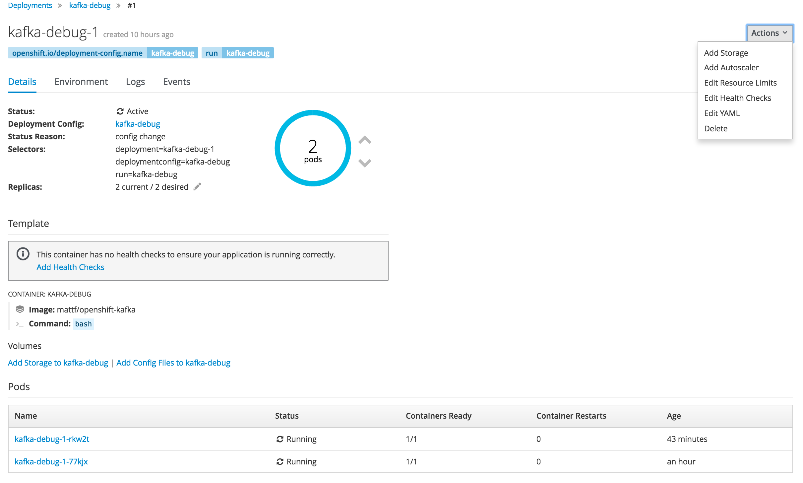

# Quick Start Explained ( part 3 of 4)
##  Deploy a debugging container and connect to it

``` bash
oc run -it --rm kafka-debug --image=rondinif/openshift-kafka --command -- bash
```
let's explain this command: 
```
$ oc help run
Create and run a particular image, possibly replicated 

Creates a deployment config to manage the created container(s). You can choose to run in the foreground for an
interactive container execution.  You may pass 'run/v1' to --generator to create a replication controller instead of a
deployment config.

  -i, --stdin=false: Keep stdin open on the container(s) in the pod, even if nothing is attached.
      --template='': Template string or path to template file to use when -o=go-template, -o=go-template-file. The
template format is golang templates [http://golang.org/pkg/text/template/#pkg-overview].
  -t, --tty=false: Allocated a TTY for each container in the pod.

   --rm=false: If true, delete resources created in this command for attached containers.

      --attach=false: If true, wait for the Pod to start running, and then attach to the Pod as if 'kubectl attach ...'
were called.  Default false, unless '-i/--stdin' is set, in which case the default is true.
```
therefore:
**kafka-debug** is the name of the **deployment config**
please note the difference between: 
**replication controller** and **deployment config**

### Deployment Config
 
when the **deploymentconfigs** already exists:

``` bash 
$ oc run -it --rm kafka-debug --image=rondinif/openshift-kafka --command -- bash
Error from server (AlreadyExists): deploymentconfigs "kafka-debug" already exists
```


